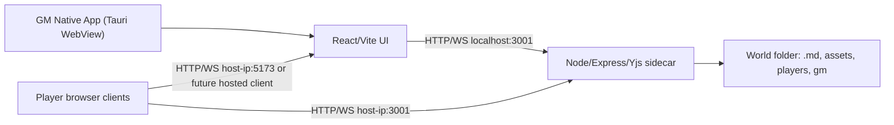

# Tauri Native Migration Gate

> Дата: 2026-06-04
> Статус: architecture/product gate. Код Tauri не начинать, пока этот gate не принят как рабочий порядок.
> Связанная задача: `FEAT-PLATFORM-TAURI-001`

## Зачем этот документ

Владелец поставил Tauri/native migration вторым крупным приоритетом после UI foundation, потому что будущий multi-window/multi-monitor режим, локальные окна на 2-3 монитора, нормальный desktop UX и Steam-friendly путь лучше делать через native runtime, а не через browser popout.

Этот документ не является командой "срочно переписать приложение". Это предохранитель: он фиксирует, что именно мигрировать, что нельзя ломать, какие риски проверить первым прототипом и где остановиться, если Tauri окажется дороже ожидаемого.

## Короткое решение

Первый правильный путь: Tauri v2 host shell + текущий React/Vite frontend + текущий Express/Yjs server как sidecar-прототип.

Не делать сразу:

- перепись Express/Yjs/file watcher на Rust;
- смену `.md` + YAML frontmatter формата;
- удаление browser-first запуска через `start.bat`;
- browser popout как основной multi-monitor foundation;
- Steamworks SDK до стабильного desktop prototype.

Главная причина: ценность проекта сейчас в Entity system, canvas, notes workspace, локальных `.md` файлах, permissions и GM workflow. Tauri должен упаковать и усилить этот фундамент, а не заменить половину проекта одной большой миграцией.

## Текущее состояние проекта

Frontend:

- `app/package.json`: Vite/React приложение, `npm.cmd run build` делает `tsc -b && vite build`.
- Dev UI сейчас живёт на Vite `5173`.
- Большая часть UI уже platform-neutral: работает через REST/WS API и localStorage, а не напрямую через Node.

Server:

- `server/package.json`: Express server запускается через `tsx src/index.ts` или `tsx watch src/index.ts`.
- `server/src/index.ts`: REST API, file watcher WS и Yjs WS живут на `3001`, bind сейчас `0.0.0.0`.
- Сервер владеет мирами, entity `.md`, assets, audio deck, players profiles и websocket sync.
- Production serving built frontend из Express пока не является оформленным контрактом.

World model:

- Source of truth остаётся папка мира на диске хоста.
- Формат `.md` + YAML frontmatter нельзя менять в Tauri-срезе.
- Игроки по-прежнему могут подключаться браузером к host IP. Native app на первом этапе нужен хосту/ГМу, а не всем игрокам.

## Целевая модель после первого прототипа



Важно: на первом Tauri-прототипе native shell не обязан решать всю player delivery. Можно сохранить текущую dev/browser схему для игроков, пока отдельно не решён production hosting built frontend.

## Фазы

### Phase 0 - этот gate

Цель: принять границы до кода.

Готово, когда:

- есть этот документ;
- roadmap/backlog ссылаются на него;
- зафиксировано, что Tauri идёт после UI foundation;
- multi-window/multi-monitor переносится после Tauri gate.

### Phase 1 - Tauri shell prototype, без packaging

Цель: проверить, что текущий frontend нормально живёт в Tauri WebView.

Срез:

- добавить `src-tauri/` в отдельной ветке;
- настроить Tauri v2 под Vite frontend;
- в dev режиме открывать UI как Tauri window;
- сервер пока может запускаться отдельно через существующий `server/npm run dev`.

Acceptance criteria:

- `npm.cmd run build` в `app` остаётся зелёным;
- текущий browser-first запуск не ломается;
- Tauri окно открывает приложение;
- login/open-world flow работает против `localhost:3001`;
- canvas, drawers, Notes workspace и asset previews не имеют WebView-only регрессий.

### Phase 2 - Node/Express sidecar prototype

Цель: проверить, можно ли Tauri управлять текущим сервером как внешним бинарником.

Срез:

- собрать server в запускаемый sidecar или временный Node-bundled command;
- прописать sidecar в Tauri `externalBin`;
- запускать sidecar из Tauri shell с минимальными permissions;
- читать stdout/stderr для диагностики;
- останавливать sidecar при закрытии native app.

Acceptance criteria:

- native app сам стартует локальный server;
- повторный запуск не оставляет висящий процесс на `3001`;
- world open/create работает;
- file watcher работает;
- Yjs world/canvas rooms работают;
- players всё ещё могут подключиться по сети;
- закрытие app корректно освобождает порт.

### Phase 3 - production frontend delivery

Цель: решить, как игроки получают UI в packaged режиме.

Варианты:

1. Express sidecar раздаёт built `app/dist` для browser players.
2. Tauri host открывает bundled UI, а player delivery остаётся отдельным lightweight browser server.
3. Dev-only `5173` остаётся только для разработки, production всегда идёт через sidecar.

Решение нельзя принимать молча, потому что оно влияет на firewall, URL для игроков, CORS, кеши ассетов и update flow.

### Phase 4 - native windows foundation

Цель: только после рабочего sidecar перейти к multi-window/multi-monitor.

Срез:

- native windows для `main`, `notes`, `canvas`, future `player-preview`;
- route/query based open target: например `#/notes?entity=...`, `#/canvas?id=...`;
- личная раскладка окон через Tauri window-state plugin;
- никакого GM-shared layout: shared content показывается через canvas pinned placements.

Acceptance criteria:

- окна независимы и могут жить на разных мониторах;
- состояние размеров/позиций восстанавливается локально;
- открытие entity в screen singleton внутри одного окна не ломает canvas pinned copies;
- local window layout не пишется в файлы мира.

### Phase 5 - Rust backend review, только если надо

Перепись сервера на Rust возможна только после доказанного Tauri sidecar path.

Переход на Rust имеет смысл, если:

- Node sidecar packaging нестабилен;
- file watcher/process lifecycle слишком хрупкий;
- Steam/installer требования требуют меньшего runtime;
- performance или security bottleneck реально измерен.

До этого Rust backend - не priority, а риск большой переписи.

## Security и permissions

Tauri v2 использует capability/permission модель: доступы задаются через capability files и scope, а опасные plugin команды должны быть явно разрешены. Для проекта это критично, потому что приложение работает с пользовательскими папками миров.

Правила для будущего `src-tauri`:

- Не давать WebView полный filesystem без scope.
- File system plugin использовать только для выбранных world dirs, app config/cache и user-approved paths.
- Shell plugin разрешать только для конкретного sidecar, а не для произвольных команд.
- Player-facing webviews не должны иметь host-only capabilities.
- Окна `main`, `notes`, `canvas`, `player-preview` должны иметь разные labels и при необходимости разные capabilities.
- Не добавлять `withGlobalTauri: true` без отдельной причины: лучше явные imports и понятные boundaries.

Практический минимум capabilities:

- `core:default`;
- shell spawn/execute только для server sidecar;
- window-state только для native windows;
- dialog/fs только после отдельного file access slice.

## File access

Текущий server уже владеет файловой моделью. Поэтому первый Tauri-срез не должен переносить чтение/запись entity `.md` во frontend.

Правильная граница:

- Tauri может дать native folder picker;
- выбранный путь передаётся существующему server endpoint `/api/world/open` или будущему host-only command;
- запись `.md`, assets, players и gm data остаётся через `server/src/worldManager.ts`, `server/src/fileManager.ts`, `server/src/assetManager.ts`;
- Obsidian-совместимость сохраняется.

Если позже появится Rust file access adapter, он должен повторить контракты текущего server layer, а не создать параллельную модель мира.

## Multi-window и multi-monitor

Позиция владельца:

- screen entity window - личный singleton;
- pinned windows/cards/tokens на canvas - отдельные shared canvas placements, одну entity можно закреплять много раз;
- GM не шарит личные окна, он закрепляет нужный объект на canvas;
- multi-monitor нужен, но после Tauri.

Из этого следует:

- Browser popout не должен становиться главным foundation.
- Native window = личный контейнер пользователя, не shared session object.
- Canvas pinned placement остаётся shared state через canvas entity.
- Notes workspace layout остаётся localStorage/native-local preference, не world file.
- Редактирование содержимого pinned entity всё равно идёт через entity permissions.

## Build/dev scripts, которые стоит добавить позже

Не добавлять сейчас без prototype branch.

Вероятный набор:

```json
{
  "scripts": {
    "tauri:dev": "tauri dev",
    "tauri:build": "tauri build",
    "desktop:check": "npm.cmd run build && tauri build --debug"
  }
}
```

Для server sidecar отдельно нужен build strategy:

- либо bundle server в один JS/executable wrapper;
- либо ship Node runtime + server files;
- либо заменить только process launcher на Rust, сохранив JS server;
- либо позже переписать server core на Rust.

Это главный технический риск. Его надо проверять Phase 2, а не прятать в конце.

## Steam-friendly ограничения

Steam путь не начинается с SDK. Сначала нужен нормальный desktop runtime.

Не делать до Tauri prototype:

- Steamworks SDK;
- Workshop upload/download;
- Steam Cloud paths;
- Steam Networking/lobbies;
- achievements/statistics.

Что держать совместимым уже сейчас:

- world folder как переносимый пакет;
- assets лежат внутри world или явно связанных папок;
- player browser workflow не зависит от Steam;
- server port и firewall story документируются.

## Rollback path

Любой Tauri-срез должен быть optional.

Rollback считается рабочим, если:

- `start.bat` продолжает запускать server + client;
- `app` и `server` можно запускать отдельно;
- нет обязательных Tauri APIs в обычном browser runtime;
- `.md` world files не получают Tauri-only поля;
- удаление `src-tauri/` не ломает frontend/server tests.

## Риски

| Риск | Почему важен | Как проверять |
|------|--------------|---------------|
| Node sidecar packaging | Express/Yjs/chokidar сейчас Node-native; Tauri сам не упакует это магически | Phase 2 proof, отдельная ветка, проверка clean machine |
| Port ownership | Server сейчас слушает `3001`; висящий процесс ломает повторный запуск | graceful shutdown, port probe, lock/status endpoint |
| Player delivery | Игрокам нужен browser UI; Tauri host window решает только GM app | Phase 3 decision |
| WebView differences | Tauri использует OS WebView; поведение может отличаться от Chrome dev | Canvas/assets/audio smoke в Tauri window |
| File permissions | Широкий fs/shell доступ опасен | capabilities-first, no arbitrary shell |
| Firewall/LAN | Host app должен быть виден игрокам по сети | Windows firewall QA, explicit host IP status |
| Auto-update/signing | Desktop distribution требует подписи/обновлений | не трогать до playable desktop prototype |

## Минимальный QA checklist для первого native prototype

- Открыть приложение в обычном browser режиме и убедиться, что старый path жив.
- Открыть Tauri main window.
- Создать/открыть test world copy.
- Проверить `GET /api/world/status`.
- Проверить EntityDatabase, AssetBrowser preview, AudioDesk file list.
- Проверить canvas pan/zoom, middle-button pan и pinned windows.
- Проверить Notes workspace tabs/splits.
- Проверить Yjs world room и canvas room.
- Подключить player browser с другой машины/виртуального клиента.
- Закрыть Tauri app и проверить, что порт `3001` освобождён.

## Открытые вопросы для владельца, но не блокеры текущего docs gate

1. В packaged desktop версии игроки должны открывать UI с host sidecar на одном порту или можно оставить отдельный player URL/launcher flow?
2. Нужно ли в первом desktop prototype показывать host network status/firewall hints прямо в UI?
3. Нужны ли native окна только для GM или игрок тоже должен иметь native client позже?
4. Нужно ли хранить native window layouts отдельно per world или глобально per user?

Пока можно принять консервативное значение: GM native app first, player browser compatibility обязательна, layouts local per user, world files не трогать.

## Проверенные источники

- Tauri architecture: https://v2.tauri.app/concept/architecture/
- Tauri capabilities: https://v2.tauri.app/security/capabilities/
- Tauri shell plugin: https://v2.tauri.app/plugin/shell/
- Tauri sidecars: https://v2.tauri.app/develop/sidecar/
- Tauri WebviewWindow API: https://v2.tauri.app/reference/javascript/api/namespacewebviewwindow/
- Tauri window-state plugin: https://v2.tauri.app/plugin/window-state/
- Tauri file-system plugin: https://v2.tauri.app/plugin/file-system/
